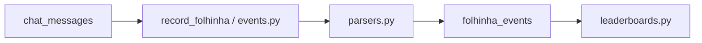

# Extend Folhinha parser / events

Wrong regex or dedupe silently empties boards. Prefer matching real FolhinhaBot strings from chat/CSV before coding. Do not commit unless asked.

Related: `add-folhinha-board` (after events exist), `run-domain-backfill` / `python -m app.scripts.backfill_folhinha_events` for history.

## Before coding — collect

1. Exact **user command** example(s) and **bot reply** example(s) (copy from chat; optional local `folhinha.csv` fixtures are gitignored)
2. Desired **`kind`** (extend `Kind` Literal if new)
3. Fields to store: actor/target, `percentage`, cookie balance/delta/wager, etc.
4. Whether historical CSV / chat backfill is required

## Architecture

| Layer | File | Role |
|-------|------|------|
| Regex / `ParsedEvent` | [`parsers.py`](../../../backend/app/services/folhinha/parsers.py) | `parse_user_command`, `parse_folhinha_reply` |
| Persist + lookback | [`events.py`](../../../backend/app/services/folhinha/events.py) | Upsert by `dedupe_key`, pair reply→command |
| Live hook | `record_folhinha` in [`stats_aggregates.py`](../../../backend/app/services/stats_aggregates.py) | Called from `INGEST_HANDLERS` |
| CSV | [`import_csv.py`](../../../backend/app/services/folhinha/import_csv.py) | Historical community log |
| Manual backfill | [`app/scripts/backfill_folhinha_events.py`](../../../backend/app/scripts/backfill_folhinha_events.py) | Rescan messages / CSV |

## Checklist

1. **`parsers.py`**
   - Add/adjust `USER_*` and reply regexes
   - Extend `Kind` if needed
   - Return `ParsedEvent` with realistic `confidence` (`high` / `medium` / `low`)
2. **`events.py`**
   - Handle new kind in user-command path and/or FolhinhaBot reply path
   - Stable **`dedupe_key`** (include platform, actors, coarse time bucket when replies are noisy)
   - Bonk/abraço replies often need **`LOOKBACK` (20s)** via `_find_recent_user_cmd` to recover target from `?bonk` / `?abraco`
3. **Bots**: FolhinhaBot messages are ingested as replies; ignored bots must not become actors on boards (`BOT_ACTORS` / `IGNORED_BOTS`)
4. **Indexes**: `folhinha_events` indexes live in [`database.py`](../../../backend/app/database.py) — add if querying new fields heavily
5. **Backfill** if history matters:
   - `cd backend && ./venv/bin/python -m app.scripts.backfill_folhinha_events` (see script flags / `--csv`)
   - Prefer explicit backfill over assuming lifespan will rebuild events
6. If a **new tab board** should expose the kind → continue with **`add-folhinha-board`**
7. Profile block: update [`user_stats.py`](../../../backend/app/services/folhinha/user_stats.py) when the user Folhinha card needs the metric

## Rules of thumb

- Match **real** FolhinhaBot Portuguese copy (see existing `BONK_IMPACTO` / cookie patterns) — do not invent English reply strings
- Roulette: `Click!` → survive; `BANG!` → death (often low confidence / inferred actor)
- Prefer upsert-by-`dedupe_key` over blind inserts (duplicates break counts)
- After parser changes, restart `pererecos-stats.service` so live ingest picks up code

## Smoke

1. Unit-style: call `parse_user_command` / `parse_folhinha_reply` on the sample strings
2. Insert or wait for a live event → document appears in `folhinha_events` with correct `kind` / fields
3. Existing boards that use that kind move (or new board via `add-folhinha-board`)
4. Hard-refresh Folhinha tab

## Done criteria

- [ ] Parser returns the new/fixed `ParsedEvent`
- [ ] `events.py` persists with a stable `dedupe_key`
- [ ] Live ingest and/or backfill verified
- [ ] Boards/profile updated if the product surface needs it
